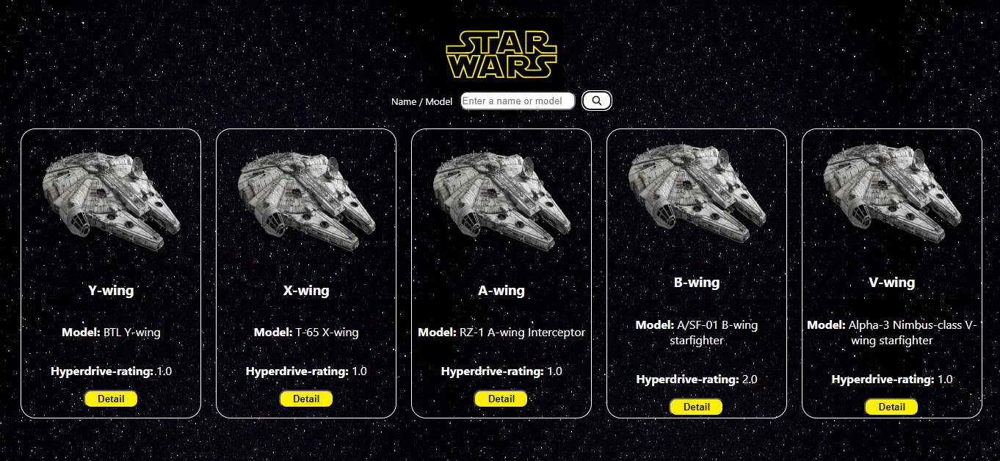
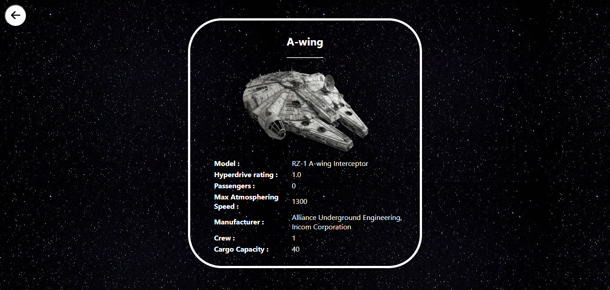

## About App
This is a service that allows users to search for starships by name or model by using the SWAPI.
## Which Technologies Used
* React.js
* Axios
* React Router

## How To Install
* Clone Repository
* ```npm install ``` command to install dependencies
* ```npm start ``` command to run

## Result
#### Main Page

---
#### Detail Page

 
